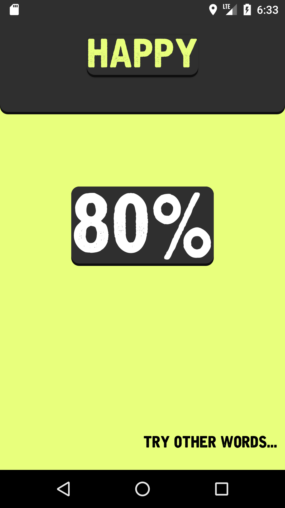
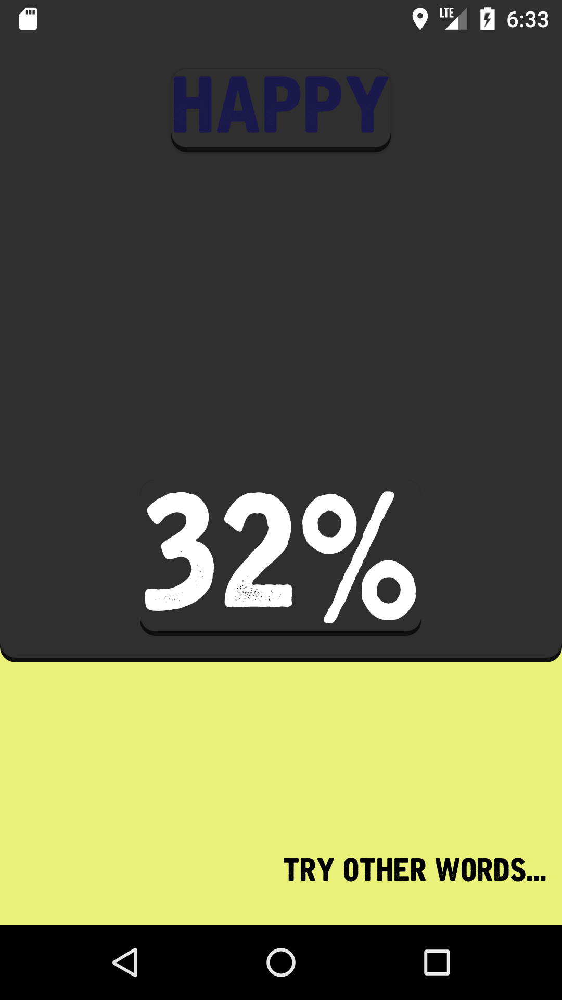
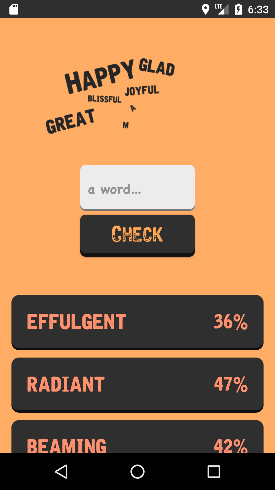
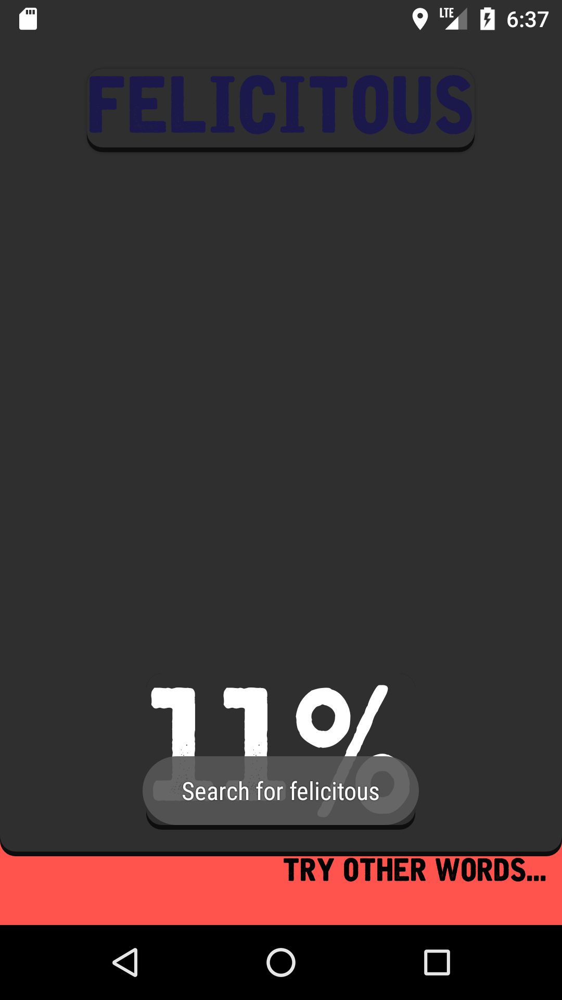
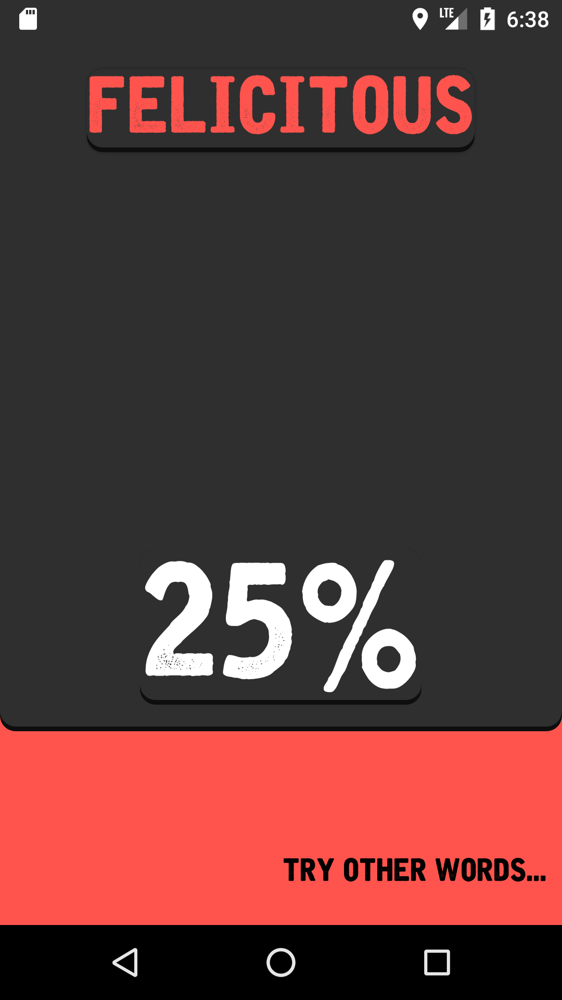
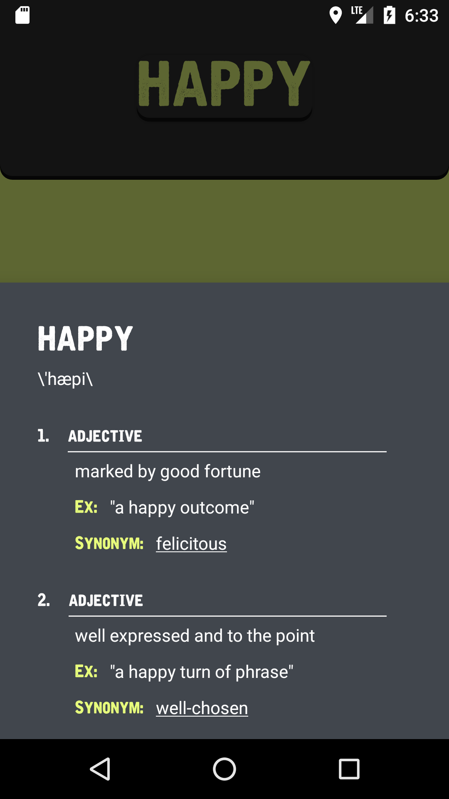

# Note
This is my friend's exisiting project in which I had the opportunity to collaborate in a college course. I assisted him in developing and also designing the interface for the Word Definition or Dictionary screen, which mainly consists of implementing a modal bottom sheet and multiple JSON handling methods besides other task-related operations.

# How-popular-Android
(the configuration file is hidden in this source code) 

## Release
- [Google Play Store](https://play.google.com/store/apps/details?id=com.lforestor.myapplication.android)

 
 
 
